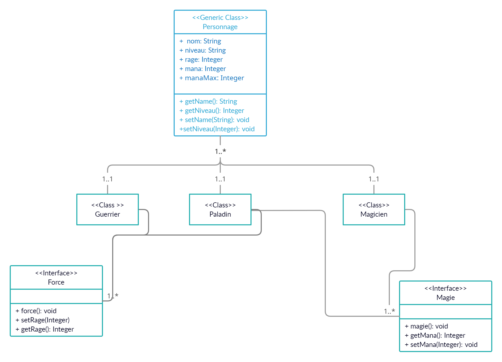

# TP Design Pattern

## Exercice 1

## Exercice 2

## Exercice 3

## Exercice 4

[Arbre2.java]()
[Client.java]()

## Exercice 5
> Nommer le design pattern à utiliser dans ces cas :
- A) Parser XML qui va enrregistrer en bdd le contenu des fichier dans des tables spécifiques
On utiliseras surement un systeme de DAO avec mapping qui va lire le fichier et le remapper en un/des objet(s) afin de le persister en bdd

- B) Creation fenetre d'une application windows rajouter les options : scroll horizontal, scroll vertical, bordure droite et gauche
On utilise ici le design pattern Observer car on doit gerer des 'evenements' on doit observé si un evenement est en cours